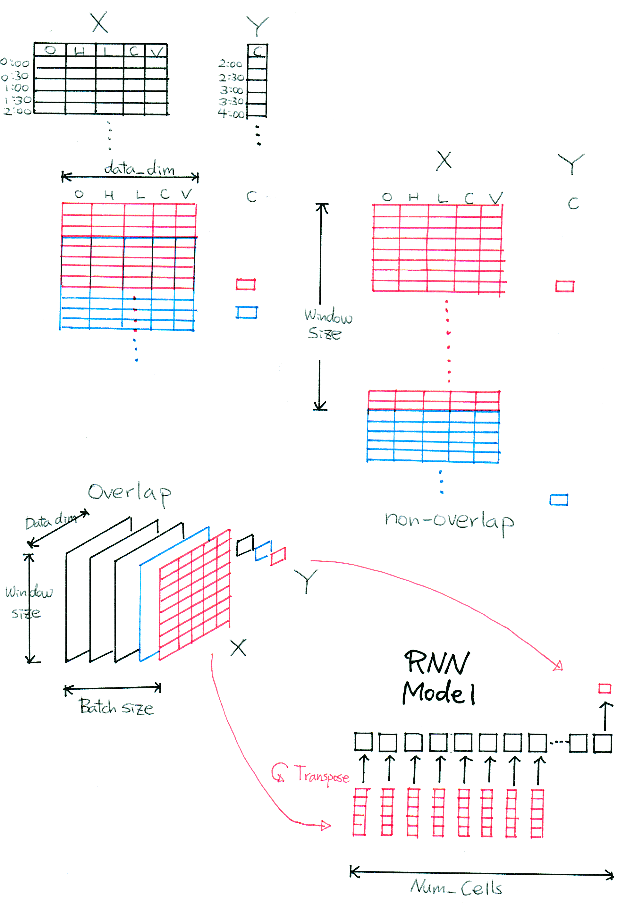
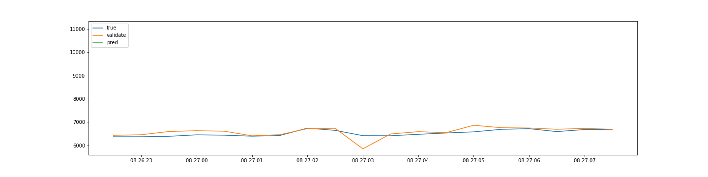

# 실행속도  

현재 1 GPU 환경에서 모델 10개를 순차적으로 학습하는데 걸리는 시간은 평균 13분 정도 소모

# 데이터 구조  

# 데이터 수집 및 분석 과정

현재 모델 10개를 가동하고, 결과를 집계하여 순위를 매기는 것 까지는 구현된 상태  

Top5 거래소의 거래 가격 정보를 취합 --> 데이터를 딥러닝에 적합한 형태로 전처리 --> 딥러닝 모델 학습 --> 예측 시간, 예측 가격, 상승, 하락, 보합 판정 등의 분석 데이터를 JSON으로 저장 --> 2시간 전의 분석데이터와 현재 가격을 비교해서 2시간 전의 예측 결과를 맞추었는지 판정 --> 오차가 적은 순서대로 Ranking --> Ranking data를 별도의 Json으로 저장 (총 15분 정도 소요되고 2시간마다 반복) 

Thread 10개로 모델을 돌리는 것보다 순차적으로 모델을 10개 돌리는 것이 2배 정도 속도의 향상이 있음.  

예) [2018-08-27 02:00:00] 표준시 0시(한국시간 오전9시)에 예측한 표준시 2시(오전 11시) 가격 (6670.07698)  

|Rank|Error       |  Model_description      |Pred_movement  | True_movement         |  Pred_price |
|--- | ---------  | ---------------------   | ------------- | ------------ | ----------- |
| 1 |    24.69666|          2-layer-RNN    |      Rise     |Fall|  6737.10700|
| 2  | 337.39866  |  Wavelet Transform-LSTM |      Rise     |Fall|  7049.80900 |
| 3 |  688.46566 |          3-layer-LSTM   |       Rise    |Fall| 7400.87600  |
| 4 | 1903.04666 |    Simple LSTM model    |      Rise     |Fall| 8615.45700  | 
| 5 | 2195.56710 | Random Forest Regressor |       Rise    |Fall|  8907.97744 |
| 6  |  3331.90766|     Simple GRU model    |       Rise    |Fall|  10044.31800|
| 7  | 3340.18966 |      Simple RNN model   |     Rise      |Fall|  10052.60000|
| 8  | 4086.28666 |          2-layer-GRU    |      Rise     |Fall| 10798.69700 |
| 9  | 4774.77716 |   2-layer-LSTM          |  Rise         | Fall      | 11487.18750 |
| 10  | - |   Differentiate-LSTM    |  Rise         |Fall|  +196.44441  |

Model Validation(주황색과 파란색 선)에서는 문제가 없는데 최종 예측값(2시간 이후, 녹색)의 오차가 너무 커서, 조사중
  

  

