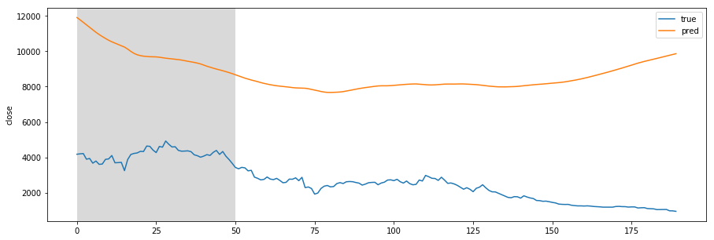
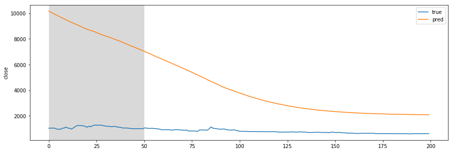
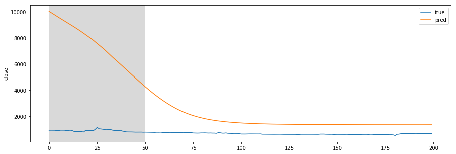
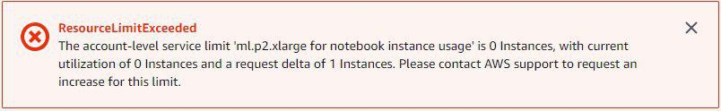

## Test in Local Environment
  
1 Simple LSTM - Pilot Step  

| Dataset Size     | Batch |  Epoch  | Prediction Time Step | Train Error | Validation Error | Test Error |
| ---------------- | ----- | ------- | -------------------- | ----------- | ---------------- | ---------- |  
| 300(Train), 200(Test)| 25  |  20   |      t+2             | 0.0057      |    0.2608           | 0.1749641  | 
| 480(Train), 320(Test)| 2   |  20   |      t+5             | 0.0132      |     0.0132           | 0.0182414  | 
| 540(Train), 360(Test)| 3   |  50   |      t+5             | 0.0097      |     0.0032           | 0.00318466 |

Training Data (overfitting)  
  
Test Data 1  

Test Data 2  
 
Test Data 3  

Overfitting이 줄고 Prediction accuracy가 많이 좋아진 것을 알 수 있다.

## From Regression to Classification  

가격을 정확히 예측하는 모델과 함께, 가격의 변동추세(상승, 보합, 하락)를 예측하는 모델도 필요  
두 가지 형태의 방식을 생각해볼 수 있다.  
1. 가격을 예측하는 모델에서 예측 가격 P'(t+1)과 이전 실제 가격을 P(t) 비교해서 결론을 내는 방법 : Error = P'(t+1) - P(t+1)  
2. 가격 변동의 추세를 정확히 맞추어 가는 방향으로 모델 생성    

| Date  | Close | Movement | Volume | 
| ---- | ----- | ----- | ------ | 
| 2014-05-01 00:00:00 | 4325 | 2  | 3414143 | 
| 2014-05-01 00:30:00 | 2132 | 0 | 3441244 | 

## AWS 
SageMaker 인스턴스 생성 관련하여 아래와 같은 문제가 생겨서  
Amazon에 Request를 넣은 상태임  
 
Response  
> Can you please confirm the below information with me :
1. AWS region for which you wish to increase this limit for [ml.p3.2.xlarge instance] in your account [360516151325] 
2. Also please confirm the number of instances [ml.p3.2.xlarge] you wish to launch, so i will increase this limit to that number.  

--> Request Again
Region : "Asia/Seoul",   
2개 Instances to launch (ml.p3.2.xlarge, ml.p3.8.xlarge.)

Response  
> I went ahead for you and requested the limit increase in Asia/Seoul region for your account [360516151325] and our internal sagemaker team approved this request for you and it will take effect shortly.  

생성완료