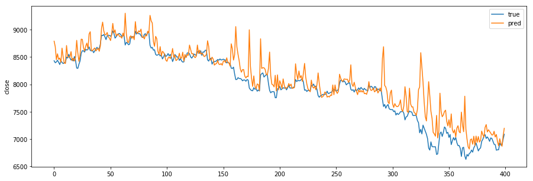
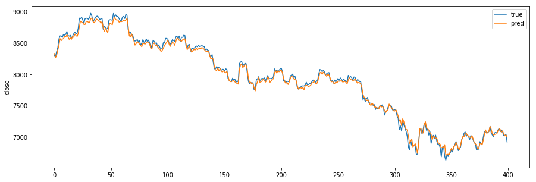
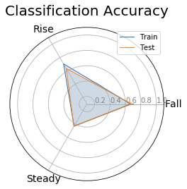
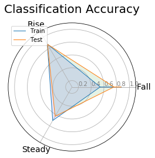

# Price prediction improvement  

작업 환경을 AWS로 옮기고 모델 구현 코드를 대폭 수정한 결과, 모델의 가격 예측 정확도 향상을 이룰 수 있었음.  

### 20 LSTM units, 8 Epochs, Batch size = 30 (Test error = 0.000208)

  

### 50 LSTM units, 36 Epochs, Batch size = 30 (Test error = 0.000015)

  

----------------------------------

# Challenges in Classification  

상승, 보합, 하락이라는 3계층 분류 문제에 있어서는 LSTM 모델의 정확도가 만족스럽지 못했는데, 그 이유는 상승과 같은 값들은 예측 시점 뿐만 아니라 바로 전 시점의 값과 비교를 한 결과이기 때문에 가격 예측 문제보다 차원 하나가 더 늘어나는 셈이라, 이 부분에서 모델의 정확도가 떨어지는 것으로 생각된다.  
상승, 보합, 하락의 본질은 변화율로도 볼 수 있기 때문에 여기에 착안하여 아예 입력 데이터를 가격, 거래량이 아닌 가격의 1차 미분, 거래량의 1차 미분값들로 바꾸고, 예측 대상자체도 가격 그 자체가 아닌 가격의 변화율로 하고, 3 Class의 정의도 변화율의 범위로 설정하였다. 그 결과 분류 정확도의 향상이 있었다.  
아래의 plot은 좌측은 가격, 거래량을 입력값으로 한 결과(Total Accuracy : 0.32)이고, 우측은 1차 미분값을 입력값으로 한 결과(Total Accuracy : 0.635)이다.    

  

그럼에도 분류 정확도에는 여전히 아쉬움이 남는데, 시계열 데이터를 분류 문제로 전환해서 기계 학습을 하는 것은 생각보다 어려운 문제이며, LSTM과 같은 RNN 계열의 모델이 갖는 본질적인 한계일 수도 있다. 따라서 CNN이나, GAN, Reinforcement Learning 등과 같은 대안도 모색할 필요가 있다.