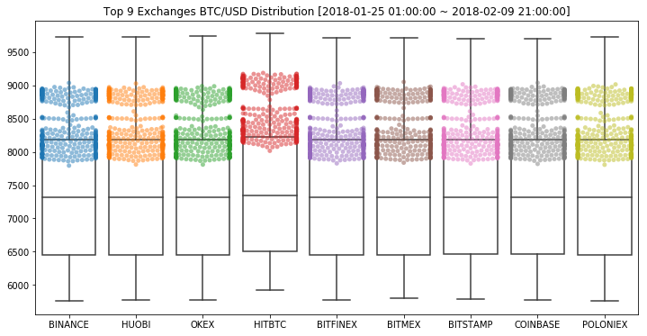
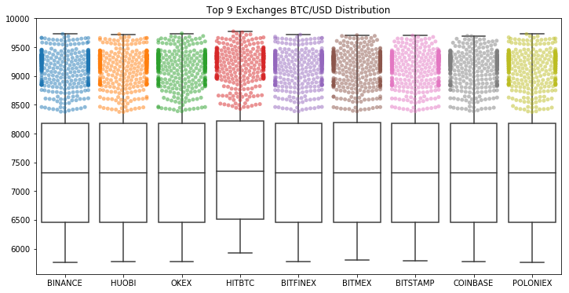
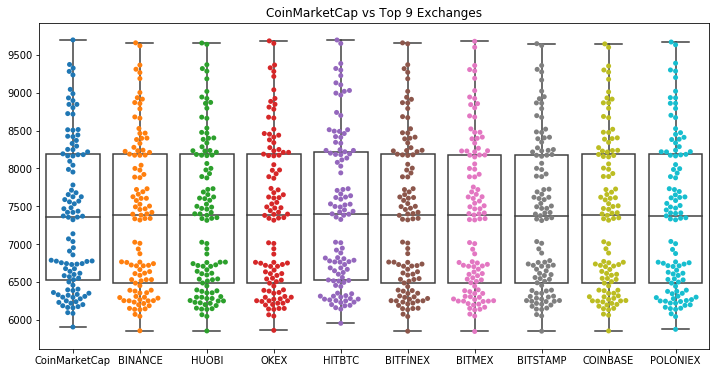
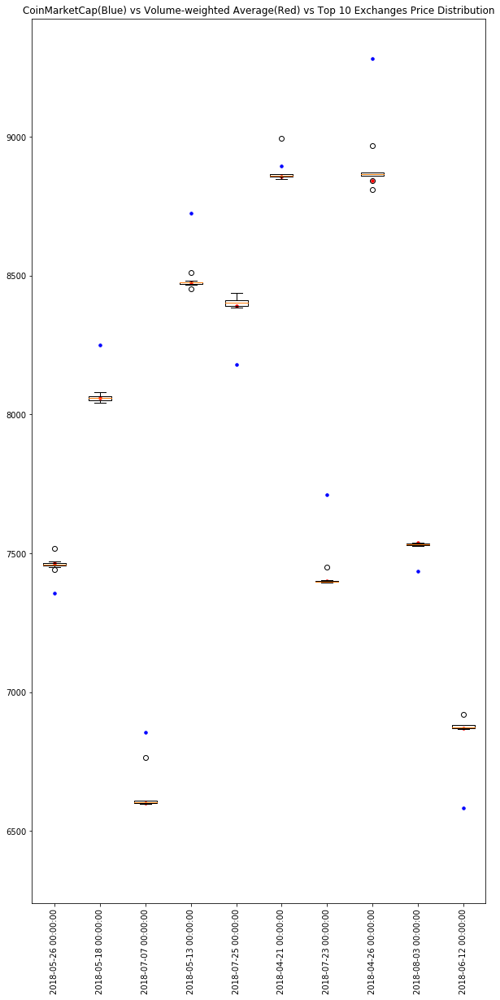
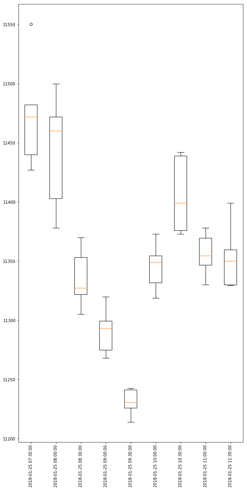

# Top 9 거래소의 가격 정보 분포  
 
  

상위 9개 거래소의 가격은 편차가 크지는 않아 보인다.  

  

CoinMarketCap의 환산 가격 분포와 비교했을 때도 시각적으로 특이적인 값을 갖는 분포는 역시 잘 보이지 않음.  
그럼 상위 9개 거래소의 가격들을 그들의 거래량으로 가중 평균했을 때는 어떨까?  
파란색 점이 CoinMarketCap의 가격 정보이고, 붉은색이 상위 9개 거래소의 Volume Weighted Average, Boxplot이 Top9 거래소의 분포이다.  

  

결과적으로 CoinMarketCap(Blue point)과 상위 9개 거래소(Box plot)의 가격 편차는 크게 나타나며, 거래량으로 가중평균(Red point)을 해도 결과는 달라지지 않는다. 그렇다면 CoinMarketCap에 무조건 맞추기 보다는 거래소의 평균을 사용하는 것이 신뢰성이 높을 수도 있을 것이다.  

------------------------------------------

# Top 5 거래소의 거래량 정보 분포  

거래량의 경우 거래소 마다 편차가 크고 outlier들이 존재한다.  

  

이런 특성상 평균은 Outlier effect에 따라 정보를 왜곡할 위험이 있으므로 중간값을 취하는 것이 합당해 보인다.  
