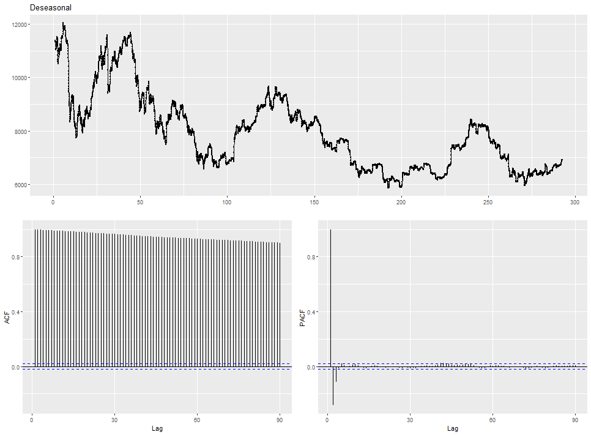
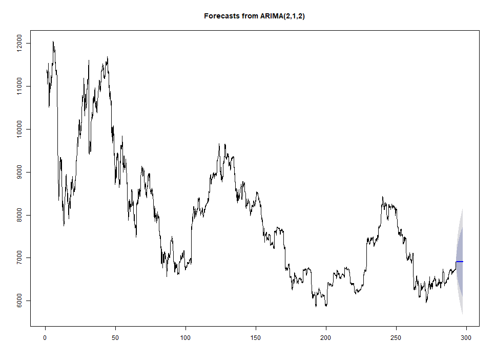

# 시계열(time series) 분석  
분석에는 R의 forecast package가 사용되었다.  

## BTC price data를 자세히 살펴보자.  

시계열 데이터의 계절성 Seasonality, 추세 Trend, 무작위성 random을 요소 분해를 하면 다음과 같다.  
 

## BTC price는 정상 시계열 인가?  
[Augmented Dickey-Fuller Test  ]  
data:  Deseasonal_BTC  
Dickey-Fuller = -1.745, Lag order = 0, p-value = 0.6864  
alternative hypothesis: stationary

Stationary로 볼 수 있다.  

## auto.arima 결과  
  
Series: Deseasonal   
ARIMA(2,1,2)(2,0,1)[30] with drift 

Coefficients:  

| ------ |    ar1   |   ar2  |   ma1   |   ma2   |  sar1 |    sar2 |   sma1 |   drift |
| ----- | -------- | ------ | ------- | ------- | ----- | ------- | ------ | ----- |
|       |  1.3215  | -0.5176|  0.5384 | -0.4185 | -0.1080| -0.0062| 0.1241 |  -0.4895 |
| s.e.  |  0.0244  | 0.0183 | 0.0260  | 0.0253  | 0.6979 |  0.0180|  0.6978|   0.5812 |

sigma^2 estimated as 89.11:  log likelihood=-32053.16  
AIC=64124.32  
AICc=64124.34   
BIC=64188.01

## Fit to ARIMA model
Call:  
arima(x = Deseasonal, order = c(2, 1, 2))

Coefficients:  

|     |  ar1  |    ar2 |  ma1  |    ma2 |
| --- | ----- | ------ | ----- | ------ |
| --- | 1.3221| -0.5177| 0.5378| -0.4187|
|s.e. | 0.0244|  0.0184| 0.0260|  0.0253|  

sigma^2 estimated as 89.05:   
log likelihood = -32054.93,   
aic = 64119.87

## 예측 가격  
|예측가격 | 하한(80%신뢰구간)| 상한(80%신뢰구간)| 하한(95%신뢰구간)| 하한(95%신뢰구간)|
| ------ | ----------------| --------------- | --------------- | --------- |
| 6909.450| 6792.012       | 7026.888        | 6729.843        | 7089.057  |

