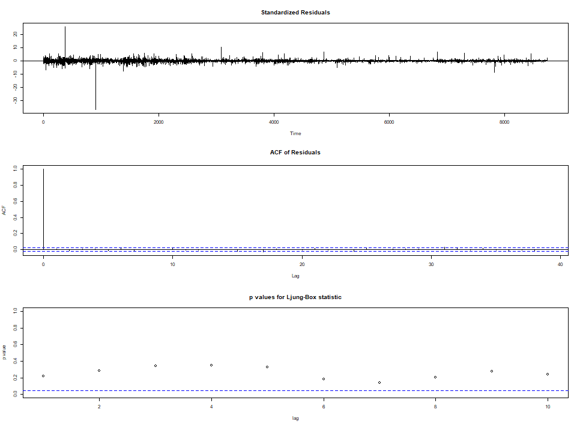

# 시계열(time series) 분석  
분석에는 R의 forecast package가 사용되었다.  

## BTC price data를 자세히 살펴보자.  
시계열 데이터의 계절성 Seasonality, 추세 Trend, 무작위성 random을 요소 분해를 하면 다음과 같다.  
 

## BTC price는 정상 시계열 인가?  
[Augmented Dickey-Fuller Test  ]  
data:  Deseasonal_BTC  
Dickey-Fuller = -1.745, Lag order = 0, p-value = 0.6864  
alternative hypothesis: stationary

Stationary로 볼 수 있다.  

## auto.arima 결과  
Series: BTC_USD   
ARIMA(2,1,2)   
Coefficients:  
|   |  ar1   |   ar2  |   ma1 |  ma2   |
| --| ------ | ------ | ----- | ------ |
|   | 0.9909 | -0.7735|  -0.9433|  0.7374|
|s.e.|  0.0733|   0.0913|   0.0803|  0.0966|

sigma^2  estimated as 3564:  log likelihood=-48211.66  
AIC=96433.31    AICc=96433.32    BIC=96468.7   

결정된 3 파라미터  
| AR(p)  | MA(q) |  I(d) |
| ------ | ----- | ----- |
| p -> 2 | q -> 1| d -> 2|

  

