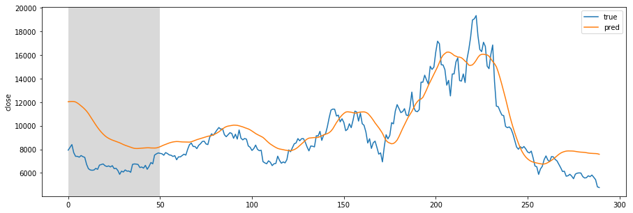

## Test in Local Environment
  
1 Simple LSTM  
Dataset : OHLCV daily (290 days)  = 261 Training + 29 Test set  
Batch : 25 randomized batch & 220 Time-series observations (261 training data 중에서 무작위로 220 days를 25가지 뽑음)  
Prediction : 이틀 뒤(t+2)의 Closed price를 예측    

6번째 Epoch에서 loss minization 향상이 없어서 Early Stopping  
Training error = 0.0057  
Validation error = 0.2608  
Test error = 0.17496411502361298    
Training Data  
  
Test Data  

  
Overfitting 문제로 Test data에서의 Prediction accuracy가 떨어지는 것을 알 수 있다  

## AWS 
SageMaker 인스턴스 생성 관련하여 아래와 같은 문제가 생겨서  
Amazon에 Request를 넣은 상태임  
 